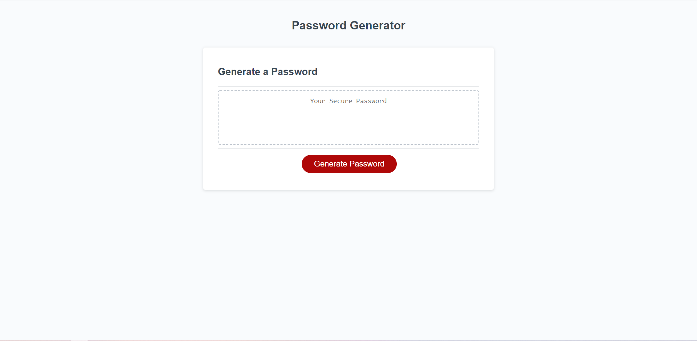
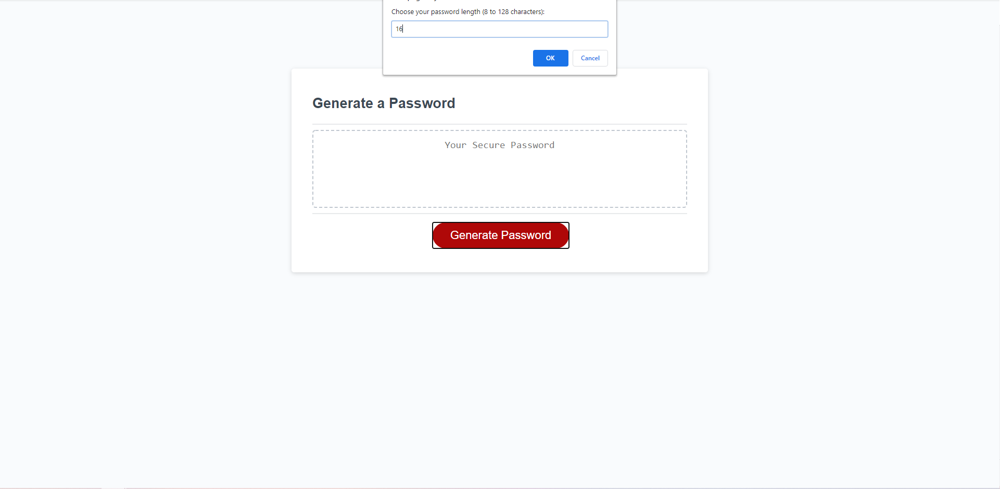
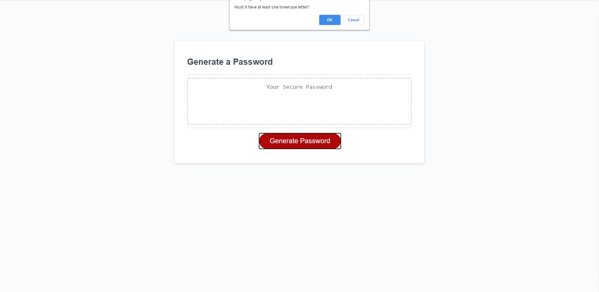
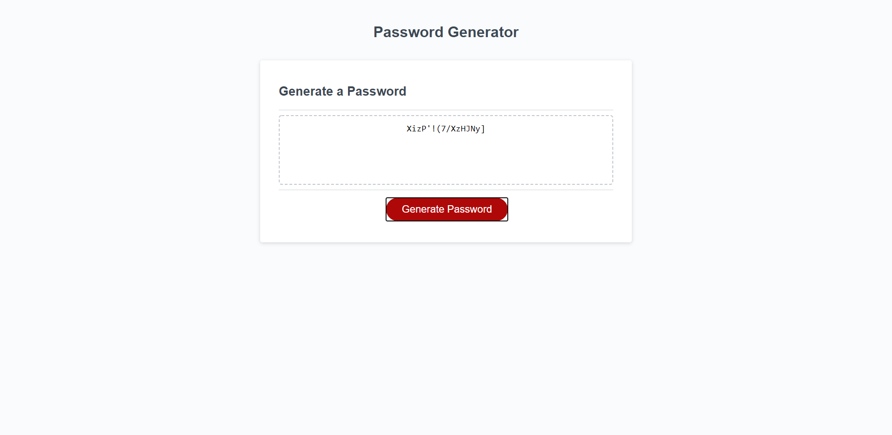

# js-password-generator

## Description
The purpose of this project was to take webpage already complete with HTML and CSS code, and add Javascript to it to generate a password for the user
upon them clicking the "generate password" button. The parameters for the password are rather simple, as the user has the option of having the password
be between 8 and 128 characters, and include any of the following: lowercase letters, uppercase letters, numerical characters and special characters.

As you can see by looking in the  file, the password is generated using the built-in JavaScript function Math.random() to get a
random number between 32 and 126, which in turn is used to create the ASCII code for a certain character in HTML. Using this combine with an easy reference to which
numnbers correspond with which characters, it is then just a matter of creating the logic to determine whether or not the random character generated was valid 
according to the parameters the user sets.

## Screenshots

## Links

- Repo (Yes this one): https://github.com/TopGek99/js-password-generator
- Webpage: https://topgek99.github.io/js-password-generator/
